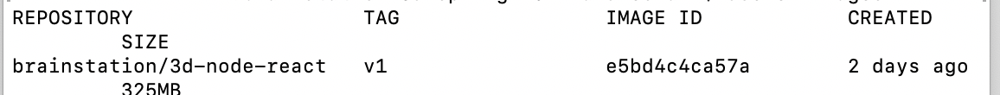

# Docker Configuration

## Setup

### Requirements

- Docker Desktop Community 2.0.0.3+
- Node 10.15+
- NPM 6.4.1+

Install Docker per the instructions for the platform it is on.

### Creating Base Docker Image

Using the `Dockerfile` in this repo, run the following commands: 

```bash
$ docker build --rm -t brainstation/3d-node-react:v1 .
$ docker container prune
```


This will download the node image from docker and create the image on your computer




### Create repos for students

On GitHub, create a repository with a basic create-react-app and Express server. Something like this:

```
.
├── client
│   ├── README.md
│   ├── package-lock.json
│   ├── package.json
│   ├── public
│   │   ├── favicon.ico
│   │   ├── index.html
│   │   └── manifest.json
│   └── src
│       ├── App.css
│       ├── App.js
│       ├── App.test.js
│       ├── index.css
│       ├── index.js
│       ├── logo.svg
│       └── serviceWorker.js
├── package-lock.json
├── package.json
└── server
    ├── functions.js
    ├── package-lock.json
    ├── package.json
    └── server.js

```

You can reference the following repo: [BrainStation 3D Team Master](https://github.com/andresmall-educator/brainstation-3d-team-master)


## Run Container with Student files

Clone the student repositories to the child directory `repos	`

```bash
$ docker run --rm -p 3000:3000 -p 8080:8080 --name bs-3d-team -v $(pwd)/repos/<<team-dir>>:/app brainstation/3d-node-react:v1
```

Basically you are mounting the directory into the Docker container.

**Be aware** that this process requires a lengthy first-run! The `npm install` process for the server and the React client (create-react-app) is long about 2-3 mins. afterwards the start time is about 90 secs.


## Additional Docker Operations

### List images

```
$ docker images
```

### Remove an existing image

```
$ docker rmi <<image id>>
```

More help can be found on [Digital Ocean](https://www.digitalocean.com/community/tutorials/how-to-remove-docker-images-containers-and-volumes)


### List currently running containers

```bash
$ docker container ls
```


### Get container ID from the *name* of the container

```
$ docker inspect -f   '{{.Id}}'  <<container name>>
```

### Get container ID from the *name* of the container

```bash
$ docker inspect -f   '{{.Id}}'  <<container name>>
```

### Copy files/folders into current running container

```bash
$ docker cp ./hackathon <<container ID>>:./app
```

Becareful when copying as the command above will copy the `hackathon` directory into `/app`

### Exec shell commands in the running container

```bash
$ docker exec <<container ID>> rm -rvf /app/hackathon
```